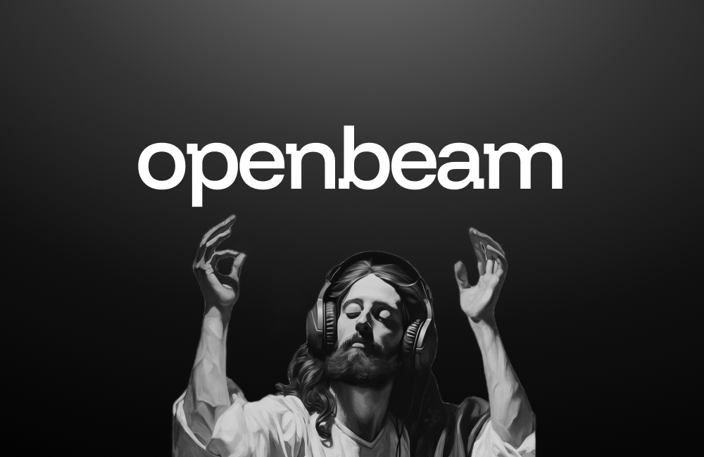
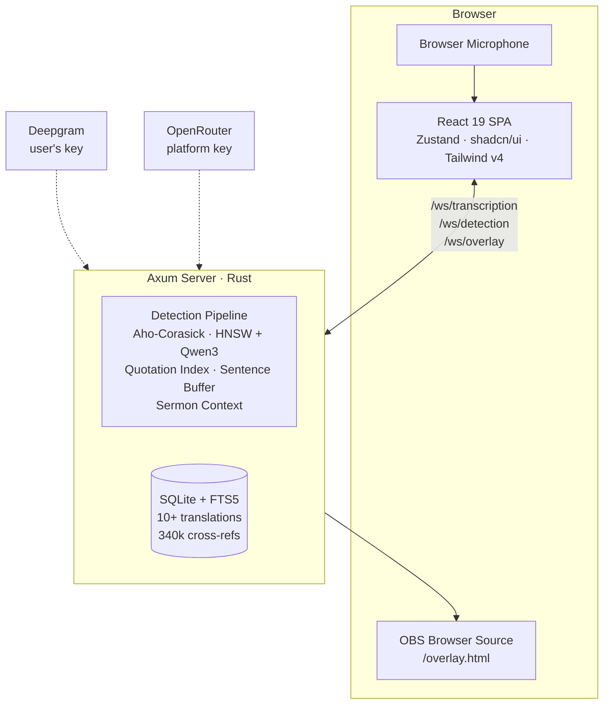

<p align="center">
  <picture>
    <source media="(prefers-color-scheme: dark)" srcset="./openbeam-dark.png" />
    <source media="(prefers-color-scheme: light)" srcset="./openbeam-light.png" />
    
  </picture>
</p>
<p align="center">
  Real-time Bible verse detection for live sermons — in your browser.
  <br />
  <a href="https://openbeam.tensorkit.ai"><strong>Try it live</strong></a> &middot; <a href="https://github.com/openbezal/rhema">Rhema Desktop</a> &middot; <a href="#quick-start">Quick Start</a>
</p>

---

OpenBeam is the cloud companion to [Rhema](https://github.com/openbezal/rhema), a desktop application for real-time Bible verse detection during live sermons. OpenBeam brings the same multi-strategy detection pipeline to the browser — no downloads, no installation, no setup beyond a Deepgram API key.

A preacher says *"nothing can separate us from God's love"* and OpenBeam surfaces **Romans 8:38-39** in real-time, ready for your broadcast overlay.

<p align="center">
  
</p>

## Why OpenBeam exists

Rhema is a powerful desktop tool, but trying it means downloading a Tauri app, compiling Rust, setting up ONNX models, and configuring NDI. That's a lot to ask before you even know if verse detection is useful for your ministry.

OpenBeam removes that barrier. Open a URL, enter your Deepgram key, and start detecting verses. If it changes how you do live services — and we think it will — [Rhema Desktop](https://github.com/openbezal/rhema) is there when you're ready for the full broadcast production experience.

## Detection Pipeline

OpenBeam doesn't use a single method to find verses. It runs four strategies simultaneously and merges results with confidence weighting:

### Aho-Corasick Automaton — Direct References
A compiled finite automaton that matches all 66 book names, their abbreviations, and spoken variants in a single pass over the transcript. When a preacher says *"turn to First Corinthians chapter 13"*, the automaton catches it instantly — no regex backtracking, no LLM round-trip.

Handles fuzzy spoken formats: *"one nineteen verse one oh five"* resolves to Psalm 119:105.

### Semantic Search — Paraphrases and Allusions
Embeds transcript segments via [Qwen3-Embedding-8B](https://huggingface.co/Qwen/Qwen3-Embedding-8B) through OpenRouter, then searches a pre-built HNSW vector index of 31,000+ verse embeddings. This catches what pattern matching cannot — when a speaker alludes to a verse without naming it.

*"Put on the full armor so you can stand against the enemy's schemes"* matches **Ephesians 6:11** even though no book or chapter was mentioned.

### Quotation Matching — Verbatim Text
An inverted word index built from every verse in the Bible. When someone quotes scripture word-for-word (or close to it), the overlap score surfaces the match even without a direct reference.

*"The Lord is my shepherd, I shall not want"* immediately resolves to **Psalm 23:1**.

### Ensemble Merger
All three strategies feed into a confidence-weighted merger with deduplication and cooldown. A verse detected by multiple strategies gets a boosted confidence score. A verse that was just displayed gets suppressed to avoid repetition. The result: the right verse surfaces at the right time.

## Architecture



| Layer | Stack |
|-------|-------|
| **Frontend** | React 19, Vite 7, Tailwind CSS v4, shadcn/ui, Zustand, Fabric.js |
| **Backend** | Axum (Rust), SQLite + FTS5, Aho-Corasick, HNSW vector search |
| **Speech-to-Text** | Deepgram Nova-3 (BYOK — bring your own key) |
| **Embeddings** | Qwen3-Embedding-8B via OpenRouter (platform-provided) |
| **Broadcast** | OBS Browser Source overlay with Canvas 2D rendering |
| **Remote Control** | OSC (Stream Deck, TouchOSC) + HTTP API |

## Quick Start

### Hosted

Visit [openbeam.tensorkit.ai](https://openbeam.tensorkit.ai), enter your [Deepgram API key](https://console.deepgram.com), and start transcribing.

### Self-Hosted

```bash
git clone https://github.com/tensorkithq/openbeam.git
cd openbeam

# Enter dev shell (requires Nix)
nix develop

# Set your OpenRouter key for embeddings
echo "OPENROUTER_API_KEY=sk-or-..." > apps/server/.env

# Launch both services
start
```

The `start` command builds the Rust server (:4001) and launches the Vite dev server (:4000). Run `status` to check health, `stop` to shut down, `logs` to tail output.

### Deploy to Railway

Create a new Railway project with two services pointing at this repo:

1. **Server** — set Root Directory to `apps/server`
   - Add env var `OPENROUTER_API_KEY`
   - Railway auto-assigns `PORT`
2. **Web** — set Root Directory to `apps/web`
   - Add env var `VITE_API_URL` = the server service's public URL (e.g. `https://openbeam-server-production.up.railway.app`)
   - Railway auto-assigns `PORT`

Both services pick up their `railway.toml` configs automatically.

### Environment Variables

**Server** (`apps/server`)

| Variable | Required | Default | Description |
|----------|----------|---------|-------------|
| `OPENROUTER_API_KEY` | Yes | — | Qwen3 embedding API key (platform cost, ~$11/mo at 10K users) |
| `PORT` | No | 4001 | Server port (Railway sets this automatically) |
| `DB_PATH` | No | ./data/openbeam.db | Bible database path |
| `STATIC_DIR` | No | — | Path to built SPA files (for single-binary self-hosting) |
| `RUST_LOG` | No | info | Log level |

**Web** (`apps/web`)

| Variable | Required | Default | Description |
|----------|----------|---------|-------------|
| `VITE_API_URL` | Railway only | — | Server service URL (baked into the build; falls back to same-origin for local dev) |
| `PORT` | No | 3000 | Static file server port (Railway sets this automatically) |

Users provide their own Deepgram API key in the browser. It's stored in [`localStorage`](apps/web/src/stores/settings-store.ts#L3) — the server never persists it, only [passing it through](apps/server/src/routes/stt.rs#L15-L24) to Deepgram's WebSocket per-connection.

## Features

- **Real-time transcription** with live partial results as the speaker talks
- **Multi-strategy verse detection** running four algorithms simultaneously
- **10+ Bible translations** — KJV, NIV, ESV, NASB, NKJV, NLT, AMP, plus Spanish, French, Portuguese
- **340,000+ cross-references** from openbible.info
- **Full-text search** across all translations via SQLite FTS5
- **Broadcast overlay** for OBS, vMix, xSplit — transparent Canvas 2D rendering
- **Theme designer** — visual editor for verse overlay appearance (fonts, colors, backgrounds, layout)
- **Verse queue** with drag-and-drop reordering
- **Remote control** via OSC (Stream Deck, TouchOSC) and HTTP API
- **Audio level metering** with gain control
- **Sermon context tracking** — detects when a preacher is reading through a chapter sequentially
- **Zero server-side user data** — all preferences in browser localStorage

## Project Structure

```
apps
├── web
│   └── React dashboard SPA
├── server
│   ├── Axum Rust backend
│   └── crates
│       ├── bible        — SQLite Bible DB + FTS5 search
│       ├── detection    — Aho-Corasick, HNSW, quotation matcher, pipeline
│       ├── stt          — Deepgram WebSocket client
│       └── api          — OSC + HTTP remote control
packages
├── streams              — @openbeam/streams RxJS orchestration library
└── overlay              — Broadcast overlay (standalone)
```

## Design Decisions

We made deliberate trade-offs to keep OpenBeam simple and portable:

| Decision | What we chose | Why |
|----------|--------------|-----|
| **STT** | Deepgram only (BYOK) | Real-time WebSocket streaming. Whisper API is batch-only — too slow for live. |
| **Embeddings** | OpenRouter (Qwen3-8B), platform-paid | $0.01/1M tokens. 10K users costs ~$11/month. Users don't need a second API key. |
| **Broadcast** | OBS Browser Source | Covers 80%+ of use cases. NDI requires native code — deferred to Rhema Desktop. |
| **User data** | Browser localStorage only | Server is stateless. No accounts, no auth, no database of user preferences. |
| **Detection** | Server-side Rust | The pipeline (Aho-Corasick + HNSW + quotation index) needs the full Bible DB in memory. Browser can't do this efficiently. |
| **Backend** | Rust (Axum) | Reuses Rhema's detection crates directly. No rewrite needed. |

## OpenBeam vs Rhema Desktop

OpenBeam is not a replacement for Rhema. It's the evaluation ramp.

| Capability | OpenBeam (Cloud) | Rhema (Desktop) |
|-----------|-----------------|-----------------|
| Installation | None — open a URL | Download + build |
| Verse detection | Full pipeline | Full pipeline |
| Transcription | Deepgram (cloud) | Deepgram + Whisper (local, offline) |
| Broadcast output | OBS Browser Source | NDI + display output |
| Audio capture | Browser microphone | System audio + mic |
| Embeddings | Cloud API (Qwen3-8B) | Local ONNX (Qwen3-0.6B) |
| Offline mode | No | Yes (Whisper + local ONNX) |
| Theme designer | Yes | Yes |
| Remote control | OSC + HTTP | OSC + HTTP |
| User data | Browser only | Local app storage |

## Stream Orchestration (`@openbeam/streams`)

OpenBeam uses a shared RxJS library at [`packages/streams`](packages/streams/) to manage all real-time data flow. The library is framework-agnostic — it produces observables that the React app subscribes to and pushes into Zustand stores.

```
Events (WebSocket, user input) → @openbeam/streams (compose, cancel, debounce) → Zustand (state) → React (UI)
```

### What it replaces

The original hooks used manual `setTimeout` debouncing, `useRef` timer tracking, request ID counters for stale rejection, and `setInterval` polling — all hand-rolled and scattered across 6+ files. The stream library consolidates this into composable RxJS pipelines with `switchMap` (auto-cancel stale requests), `debounceTime`, `merge`, and `interval`.

### Stream factories

| Factory | Replaces | Key RxJS pattern |
|---------|----------|-----------------|
| `createTranscriptionStream` | `use-transcription.ts` event wiring | `share()` multicast for partials/finals |
| `createDetectionStream` | `use-detection-ws.ts` | Consumes `finals$` from transcription |
| `createSearchStream` | Manual debounce + requestId + fallback chain in search panel | `debounceTime` + `switchMap` + cascading `fallbackChain` operator |
| `createRemoteControlStream` | 8 separate `remoteSocket.on()` listeners | `merge()` into typed discriminated union |
| `createStatusSyncStream` | `setInterval` polling loop | `interval().pipe(switchMap(...))` |

### Parity with Rhema

OpenBeam's detection pipeline reuses Rhema's Rust crates server-side, but the client-side orchestration differs:

| Capability | OpenBeam | Rhema Desktop |
|-----------|---------|--------------|
| Stream orchestration | RxJS (`@openbeam/streams`) | Tauri event system + Rust channels |
| Sentence buffering | Server-side (Rust) | Client-side (Rust, in-process) |
| Sermon context tracking | Server-side (Rust) | Client-side (Rust, in-process) |
| Embedding inference | Cloud API (OpenRouter) | Local ONNX runtime |
| Audio pipeline | Browser AudioWorklet → WebSocket | Native audio capture → in-process |

The WebSocket boundary means OpenBeam pays latency that Rhema avoids with in-process communication. The RxJS layer mitigates this by keeping the UI responsive (non-blocking streams, automatic cancellation) while the server handles the heavy detection work.

## Performance Notes

### Search panel optimizations

The search panel renders 30+ verse rows per chapter and 15+ context search results with highlighted text. Key optimizations applied:

- **Memoized `VerseRow`** — each book tab row is a `memo()` component keyed on `(verse, isSelected)`. Selecting a new verse only re-renders the two affected rows (previously selected + newly selected), not all 30+.
- **Memoized `HighlightedText`** — regex-based word highlighting only re-runs when `text` or `query` actually change, not on every parent re-render.
- **Individual Zustand selectors** — the search panel subscribes to `useBibleStore((s) => s.currentChapter)` and `useBibleStore((s) => s.semanticResults)` separately instead of pulling the entire store. Zustand skips re-renders when the selected slice hasn't changed by reference.
- **No focus theft** — pending navigation (autocomplete, detection clicks, remote control) only focuses the panel if no `<input>` is currently active, so typing is never interrupted.

### Stream-level optimizations

- **`switchMap` cancellation** — context search automatically aborts in-flight Fuse.js/FTS/semantic requests when the user types a new character, preventing stale results from overwriting fresh ones.
- **`share()` multicast** — transcript finals are multicasted to both the transcript store and the detection stream without duplicate processing.
- **`shareReplay(1)` for connection status** — late subscribers (e.g., a status indicator mounted after the socket connects) immediately get the current status without waiting for the next change.

## Acknowledgments

OpenBeam is built on the architecture and detection pipeline of [Rhema](https://github.com/openbezal/rhema), an open-source desktop application by the [OpenBezal](https://github.com/openbezal) team. The Rust crates powering verse detection (Aho-Corasick automaton, HNSW vector index, quotation matcher, sentence buffer, sermon context tracker) were lifted directly from Rhema and adapted for web deployment.

The Bible database includes public domain translations and cross-reference data from [openbible.info](https://www.openbible.info/labs/cross-references/).

## License

See [LICENSE](./LICENSE).
